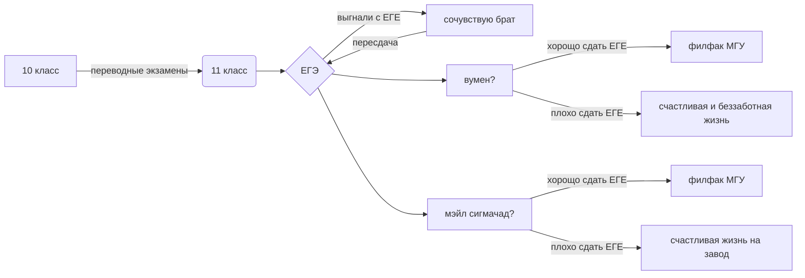

# denis ostakhov

1. $$E=mc^2$$- эквивалентность массы и энергии

2. $$-\frac{h^2}{2m}ΔΨ+UΨ=ih\frac{δΨ}{δt}$$- уравнение Шредингера

3. $$\bar{v}=\sqrt{\frac{3kT}{m_{0}}}$$- среднеквадратичная скорость молекул идеального газа

4. $$\bar{E_{1}^{2}}=\sqrt{\frac{Fa^{x-1}}{(x-1)x}}+a_{1}^{\frac{1}{3}}+β_{1}^{x^2}$$- шиза какая-то

